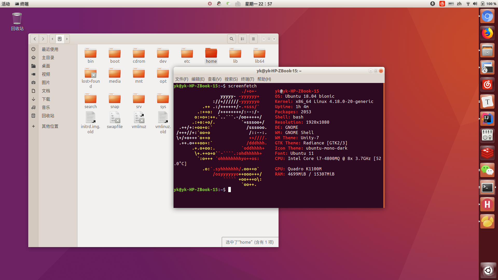

# Unity18.04 Radiance-shell主题

> 联系邮箱：[kunakun1605@163.com](mailto:kunakun1605@163.com)
>
> 

由于Ubuntu 18.04 没有Radiance主题包，基于gnome-shell，我从16.04升级上来很是难受（我的天呐，这个18.04丑死了！！！！）

安装方法

​	请把使用git clone本项目到 /usr/share/themes目录下

​	使用gnome-tweak使用主题

如果您感觉我的主题帮助到了您，那么您可以选择扫描下方的赞赏码请笔者喝杯咖啡！

微信赞赏码

支付宝赞赏码

谢谢！